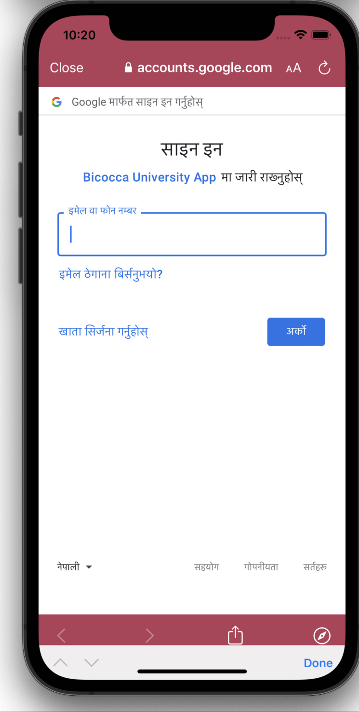

<!-- 
This README describes the package. If you publish this package to pub.dev,
this README's contents appear on the landing page for your package.

For information about how to write a good package README, see the guide for
[writing package pages](https://dart.dev/guides/libraries/writing-package-pages). 

For general information about developing packages, see the Dart guide for
[creating packages](https://dart.dev/guides/libraries/create-library-packages)
and the Flutter guide for
[developing packages and plugins](https://flutter.dev/developing-packages). 
-->

Using this package you can call the function (
    exportToGoogleCalendar(
    required String identifier,
    required String summary,
    required String description,
    required DateTime startDateTime,
    required String startTimeZone,
    required DateTime endDateTime,
    required String endTimeZone,))

    With this function the user is preseted the screen to connect their google account for adding the event for the first time only . For each successful event added true is returned otherwise false is returned .

## Features




## Getting started

First of all , you need to create a project on the google cloud platform (https://console.cloud.google.com) and activate the Google Calendar API for the project to get the api keys .

## Usage
First of all , you need to create a project on the google cloud platform (https://console.cloud.google.com) and activate the Google Calendar API for the project to get the api keys .


```
bool result = await exportToGoogleCalendar(identifier:"ssecret key",summary:"event name",description:"event description",startDateTime:DateTime.now(),startTimeZone:"GMT+2:00",endDateTime:DateTime.now().add(Duration(hours:1)),endTimeZone:"GMT+2:00");
```

## Additional information


